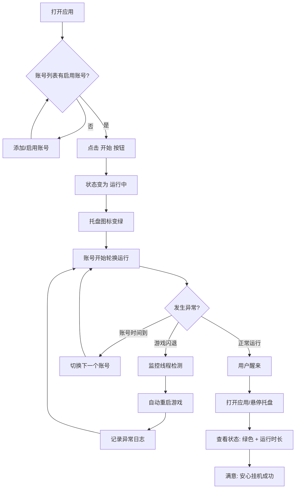
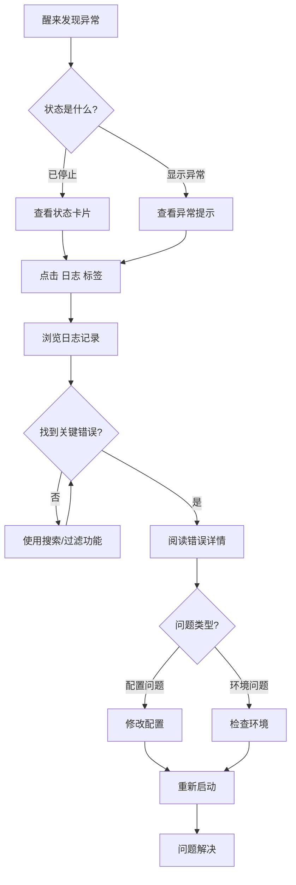
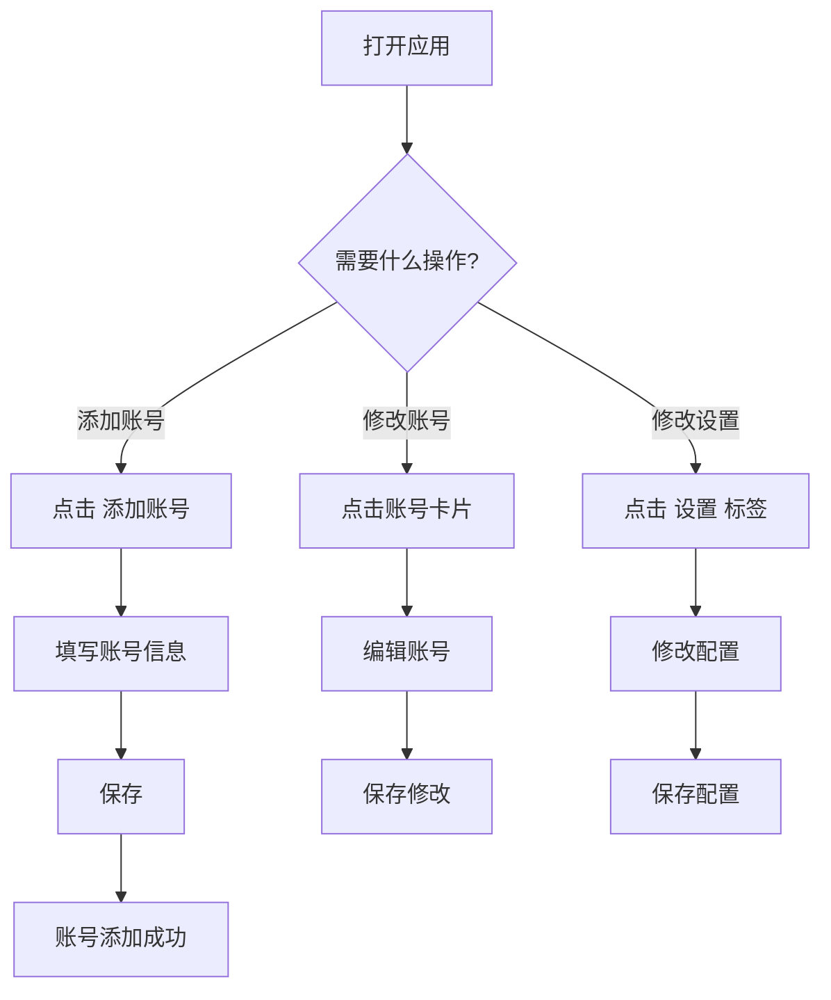

# UX 设计规范 RedDemonScript

**作者：** ckm
**日期：** 2026-03-01

---

## 执行摘要

### 项目愿景

RedDemonScript 是一款 Windows 桌面自动化脚本软件，旨在解决游戏挂机场景下的稳定性问题。通过三线程架构（脚本执行、异常监控、定时器）实现 ≥12小时不间断稳定运行，让技术型游戏玩家在睡眠时间也能安心挂机积累资源。

### 目标用户

**技术型游戏玩家（Dogfooding模式）**

- 身份：开发者兼用户
- 技术背景：具备 C++/Qt 编程能力，可自行实现脚本逻辑
- 游戏需求：拥有 3 个账号，需要轮换挂机刷资源
- 使用场景：睡眠时间挂机，醒来后检查脚本状态
- 核心痛点：现有工具不稳定，无法安心睡眠

### 关键设计挑战

1. **状态可见性**：用户需要快速了解当前运行状态（运行中/已停止/异常），特别是在醒来检查时
2. **日志可读性**：长时间运行产生大量日志，需要让用户快速定位问题
3. **账号管理简洁性**：3 账号轮换配置需要直观，避免复杂操作
4. **启动即忘**：睡前启动后无需再关注，界面应支持"最小化到托盘"

### 设计机会

1. **一目了然的状态面板**：设计清晰的状态指示器，让用户一眼看出系统是否正常
2. **智能日志摘要**：醒来时提供关键统计（运行时长、成功次数、异常次数）
3. **一键启动/停止**：简化核心操作，减少认知负担

## 核心用户体验

### 定义性体验

RedDemonScript 的核心体验是**"启动即忘"**——用户在睡前点击"开始"按钮后，可以完全放心去睡觉，系统会自动处理一切：账号轮换、异常监控、自动恢复。醒来后，用户打开窗口就能立即知道昨晚的运行状况。

**核心循环：** 配置 → 启动 → 睡眠 → 检查 → （如有问题）排查

### 平台策略

| 项目 | 决策 |
|------|------|
| 平台 | Windows 桌面应用（Qt Quick/QML） |
| 交互方式 | 鼠标/键盘，支持快捷键 |
| 离线能力 | 完全离线，无需网络 |
| 后台运行 | 支持最小化到系统托盘 |
| 多显示器 | 支持在任意显示器显示 |

### 轻松交互

| 交互 | 设计目标 |
|------|----------|
| 启动脚本 | 一键开始，无需多步确认 |
| 查看状态 | 大号状态指示器，一眼可见 |
| 查看日志 | 自动滚动到最新，支持关键词搜索 |
| 账号切换 | 自动轮换，无需手动干预 |
| 异常恢复 | 完全自动，用户无感知 |

### 关键成功时刻

1. **首次启动成功**：点击"开始"后，状态变为"运行中"，第一个账号开始运行
2. **醒来检查**：打开窗口，看到绿色状态和"运行 X 小时"的统计
3. **异常自动恢复**：日志显示夜间有闪退，但系统自动恢复继续运行
4. **添加账号成功**：新账号配置后立即出现在轮换列表，下次启动自动生效

### 体验原则

| 原则 | 说明 |
|------|------|
| **启动即忘** | 点击开始后，用户可以安心去睡觉，无需再关注 |
| **状态可见** | 任何时候打开窗口，一眼就能知道系统状态 |
| **自动优先** | 能自动化的都自动化，减少用户手动操作 |
| **日志实用** | 日志不是为了存档，而是为了快速定位问题 |

## 期望情感响应

### 主要情感目标

**核心情感：安心**

RedDemonScript 的核心情感目标是让用户感到**安心**——点击"开始"后，用户可以完全放心去睡觉，不用担心脚本中途停止、游戏闪退无人处理。醒来后，清晰的界面让用户一眼就能确认昨晚的运行状况。

**情感金字塔：**
```
           ┌─────────┐
           │  信任   │  ← 长期使用后建立
           └─────────┘
         ┌───────────────┐
         │    掌控感     │  ← 状态清晰可见
         └───────────────┘
       ┌─────────────────────┐
       │       安心          │  ← 核心情感
       └─────────────────────┘
```

### 情感旅程映射

| 阶段 | 期望情感 | 设计影响 |
|------|----------|----------|
| 首次发现 | 好奇 → 期待 | 清晰的功能说明，一眼理解价值 |
| 配置账号 | 简单 → 自信 | 简洁配置界面，无复杂选项 |
| 点击开始 | 轻松 → 安心 | 一键启动，状态立即变化 |
| 睡眠中 | 无担忧 | 后台静默运行，无需关注 |
| 醒来检查 | 满意 → 信任 | 绿色状态，清晰运行统计 |
| 遇到问题 | 不慌张 → 能解决 | 清晰错误日志，快速定位 |
| 再次使用 | 熟悉 → 依赖 | 一致体验，形成习惯 |

### 微情感

| 微情感 | 重要性 | 设计考量 |
|--------|--------|----------|
| 信心 vs 困惑 | 🔴 高 | 状态指示器必须清晰无歧义 |
| 信任 vs 怀疑 | 🔴 高 | 日志完整记录，建立信任 |
| 安心 vs 焦虑 | 🔴 高 | 异常自动恢复，无需担心 |
| 成就感 vs 挫败感 | 🟡 中 | 成功统计增强成就感 |
| 愉悦 vs 满意 | 🟢 低 | 简洁美观的界面带来愉悦 |

### 设计影响

| 情感目标 | UX 设计方法 |
|----------|-------------|
| 安心 | 大号绿色状态指示器 + 运行时长计时器 |
| 信任 | 完整日志记录 + 异常恢复通知 |
| 掌控感 | 清晰账号列表 + 当前运行账号高亮 |
| 高效 | 一键启动/停止 + 快捷键支持 |

### 情感设计原则

1. **状态永远清晰**：任何时候打开窗口，用户都能在 1 秒内知道系统状态
2. **问题可追溯**：任何异常都有清晰的日志记录，支持快速定位
3. **操作可预期**：每个操作都有明确的反馈，不产生不确定性
4. **失败可恢复**：任何失败都自动处理，用户无需干预

## UX 模式分析与灵感

### 启发性产品分析

**qBittorrent（下载工具）**
- 系统托盘图标显示下载状态（绿色/灰色）
- 简洁的任务列表，状态一目了然
- 错误状态明确显示，右键可重试

**Windows 任务管理器**
- 状态用颜色编码（无响应显示灰色）
- 标签页组织不同功能区域
- 实时刷新，信息直观

**VS Code（开发工具）**
- 底部状态栏实时显示关键信息
- 日志面板支持滚动和搜索
- 暗色主题减少视觉疲劳

### 可迁移 UX 模式

| 模式类型 | 模式 | 适用场景 |
|----------|------|----------|
| 导航模式 | 标签页切换 | 账号管理 / 日志 / 设置 分离 |
| 导航模式 | 左侧列表 + 右侧详情 | 账号列表 + 当前账号详情 |
| 交互模式 | 系统托盘状态 | 托盘图标颜色表示运行状态 |
| 交互模式 | 一键开始/停止 | 大号主操作按钮 |
| 交互模式 | 状态栏实时信息 | 底部显示运行时长、当前账号 |
| 视觉模式 | 颜色状态编码 | 绿色=运行中，红色=异常，灰色=已停止 |
| 视觉模式 | 暗色主题 | 长时间查看不疲劳 |

### 要避免的反模式

| 反模式 | 问题 | 避免方式 |
|--------|------|----------|
| 复杂配置界面 | 用户不知道怎么填 | 提供默认值，减少必填项 |
| 状态不明确 | 用户不知道脚本是否在运行 | 大号状态指示器 + 运行时长 |
| 日志过载 | 信息太多，找不到关键内容 | 关键信息高亮 + 日志级别过滤 |
| 弹窗干扰 | 打断用户 | 使用状态栏通知，不弹窗 |
| 隐藏的后台任务 | 用户不知道程序还在运行 | 系统托盘图标常驻 |

### 设计灵感策略

**要采纳：**
- 系统托盘状态指示（来自 qBittorrent）
- 底部状态栏（来自 VS Code）
- 颜色状态编码（来自任务管理器）
- 标签页组织（来自任务管理器）

**要调整：**
- 日志面板：固定显示，支持滚动和搜索
- 任务列表：简化为账号卡片形式

**要避免：**
- 复杂的多级菜单
- 弹窗通知
- 隐藏的状态信息

## 设计系统基础

### 设计系统选择

**选择方案：Qt Quick Controls 2 + Material 主题（暗色变体）**

RedDemonScript 使用 Qt Quick Controls 2 作为 UI 组件基础，采用 Material 主题的暗色变体。这是 Qt 官方提供的设计系统，无需额外依赖，开箱即用。

### 选择理由

| 理由 | 说明 |
|------|------|
| 官方支持 | Qt 官方维护，稳定可靠，与 Qt 6.8 完全兼容 |
| 快速开发 | 内置丰富控件，减少自定义开发工作量 |
| 现代外观 | Material Design 风格成熟，用户熟悉度高 |
| 暗色主题 | 支持暗色模式，适合长时间查看（符合灵感分析） |
| 低维护成本 | 无第三方依赖，长期维护简单 |
| 可扩展性 | 后期需要时可自定义控件样式 |

### 实施方法

**Qt Quick Controls 2 配置：**

```qml
// qtquickcontrols2.conf
[Controls]
Style=Material

[Material]
Theme=Dark
Primary=#2196F3
Accent=#FF5722
Background=#1e1e1e
```

**核心控件使用：**

| 控件 | 用途 |
|------|------|
| ApplicationWindow | 主窗口容器 |
| ToolBar + ToolButton | 工具栏和按钮 |
| Drawer | 侧边导航（可选） |
| SwipeView | 标签页切换 |
| ListView + Delegate | 账号列表 |
| TextArea / ScrollView | 日志显示 |
| Button | 主要操作按钮 |
| Switch / CheckBox | 开关和选项 |
| ComboBox | 下拉选择 |

### 自定义策略

**MVP 阶段（最小自定义）：**
- 使用 Material 主题默认样式
- 仅调整主题色以区分状态（绿色/红色/灰色）
- 状态指示器使用自定义组件（大号颜色块）

**后续阶段（按需自定义）：**
- 账号卡片：自定义 delegate 样式
- 状态指示器：自定义动画效果
- 日志面板：自定义高亮样式

## 核心交互设计

### 定义性体验

**"一键启动，安心睡眠"**

RedDemonScript 的定义性体验是**一键启动后安心去睡觉**——用户点击"开始"按钮后，可以完全放心去睡觉，系统会自动处理一切：账号轮换、异常监控、自动恢复。醒来后，用户打开窗口就能立即知道昨晚的运行状况。

这是用户会向朋友描述的核心操作，也是如果做完美其他一切都会顺理成章的核心交互。

### 用户心智模型

**用户期望的工作流程：**
```
配置 (一次性) → 启动 (睡前) → 检查 (醒来)
```

**现有解决方案的痛点：**

| 痛点 | 用户感受 | RedDemonScript 解决方案 |
|------|----------|------------------------|
| 脚本中途停止 | 焦虑 | 三线程架构 + 异常监控 |
| 游戏闪退无处理 | 担心 | 自动检测 + 自动恢复 |
| 状态不清晰 | 困惑 | 大号状态指示器 + 颜色编码 |
| 日志难懂 | 挫败 | 标准化日志格式 + 关键信息高亮 |

### 成功标准

| 时刻 | 成功标准 | 指标 |
|------|----------|------|
| 点击开始 | 立即响应，状态变化 | 响应 < 1秒 |
| 睡眠中 | 完全无需担心 | 稳定运行 ≥ 12小时 |
| 醒来检查 | 一眼看到状态 | 状态可见 < 1秒 |
| 异常发生 | 自动恢复 | 恢复成功率 ≥ 90% |

### 新颖 UX 模式

**核心策略：既定模式 + 一个创新点**

大部分交互使用用户已经理解的既定模式（一键启动、状态显示、系统托盘），创新点在于**全自动异常恢复**——这是差异化特性。

| 方面 | 既定模式 | RedDemonScript 独特变化 |
|------|----------|------------------------|
| 启动/停止 | 一键按钮 | 大号按钮 + 状态颜色变化 |
| 状态显示 | 图标/文字 | 大号状态卡片 + 运行时长 |
| 后台运行 | 系统托盘 | 托盘图标颜色表示状态 |
| 异常处理 | 用户干预 | **全自动恢复 + 日志记录** |

### 体验机制

**核心交互流程：**

**启动阶段：**
- 点击大号"开始"按钮
- 按钮变为"停止"，状态区域变为绿色
- 系统托盘图标变为绿色

**运行阶段：**
- 系统托盘绿色图标持续显示
- 状态栏实时更新运行时长
- 异常自动检测 → 自动恢复 → 记录日志
- 账号自动轮换，日志记录切换事件

**检查阶段：**
- 打开窗口或悬停托盘图标
- 大号绿色状态卡片 + 运行时长统计
- 如有异常，显示"异常恢复 X 次"

**停止阶段：**
- 点击"停止"按钮或关闭窗口
- 按钮变为"开始"，状态区域变为灰色
- 系统托盘图标变为灰色
- 自动保存配置和日志

## 视觉设计基础

### 颜色系统

**基础色板：**

| 类别 | 颜色 | 色值 | 用途 |
|------|------|------|------|
| 背景色 | 深灰 | `#1e1e1e` | 主窗口背景 |
| 背景色 | 中灰 | `#2d2d2d` | 卡片、面板背景 |
| 背景色 | 浅灰 | `#3d3d3d` | 悬停、选中状态 |
| 文字色 | 主文字 | `#e0e0e0` | 主要文字 |
| 文字色 | 次文字 | `#9e9e9e` | 次要文字、说明 |

**状态色板（核心差异化）：**

| 状态 | 颜色 | 色值 | 用途 |
|------|------|------|------|
| 运行中 | 绿色 | `#4CAF50` | 状态指示器、托盘图标 |
| 已停止 | 灰色 | `#9E9E9E` | 状态指示器、托盘图标 |
| 异常 | 红色 | `#F44336` | 异常提示、错误日志 |
| 警告 | 橙色 | `#FF9800` | 警告日志、注意提示 |

### 排版系统

**字体选择：**
- 主字体：系统默认无衬线
- 等宽字体：Consolas / monospace（日志显示）

**字号比例：**

| 级别 | 大小 | 用途 |
|------|------|------|
| H1 | 24px | 状态卡片大号数字 |
| H2 | 20px | 面板标题 |
| H3 | 16px | 账号名称 |
| Body | 14px | 正文、配置项 |
| Caption | 12px | 次要信息、时间戳 |
| Log | 13px | 日志内容（等宽） |

### 间距与布局基础

**间距系统（8px 基准）：**

| Token | 值 | 用途 |
|-------|-----|------|
| spacing-xs | 4px | 元素内部小间距 |
| spacing-sm | 8px | 相关元素间距 |
| spacing-md | 16px | 组件间距 |
| spacing-lg | 24px | 区块间距 |
| spacing-xl | 32px | 面板间距 |

**布局结构：**
- 窗口最小：800×600px
- 侧边栏：240px
- 工具栏：48px
- 状态栏：24px

### 无障碍考虑

- 颜色对比度 ≥ 4.5:1（WCAG AA）
- 状态不只靠颜色（颜色 + 文字 + 图标）
- 最小字体 12px，主要内容 ≥ 14px
- 支持键盘导航和焦点指示

## 设计方向决策

### 探索的设计方向

**方向 A：状态中心布局**
- 大号状态卡片居中，视觉焦点明确
- 账号卡片横向排列，空间紧凑
- 底部状态栏 + 操作按钮

**方向 B：侧边栏布局**
- 左侧固定账号列表，便于管理
- 右侧大区域显示详情和日志
- 信息层级清晰

**方向 C：标签页布局**
- 顶部标签页切换功能区域
- 状态页面聚焦核心信息
- 减少单页面信息密度

**方向 D：极简布局**
- 最大化的留白和呼吸感
- 大号单一操作按钮
- 状态信息集中在状态栏

### 选择的方向

**主界面：状态中心布局（方向 A）+ 标签页切换（方向 C）**

组合方案：
- 主界面采用状态中心布局，大号状态卡片居中
- 底部使用标签页切换日志/统计/设置
- 账号卡片横向排列在状态卡片下方
- 底部状态栏显示实时信息 + 操作按钮

### 设计理由

| 理由 | 说明 |
|------|------|
| 状态可见性 | 状态中心布局让用户一眼看到状态（安心） |
| 功能分离 | 标签页分离日志和设置，减少主界面信息密度 |
| 操作便捷 | 底部状态栏 + 操作按钮支持快捷操作 |
| 核心体验 | 符合"启动即忘"的核心体验目标 |

### 最终布局结构

```
┌─────────────────────────────────────────────────────────┐
│  RedDemonScript                              ─ □ ×      │
├─────────────────────────────────────────────────────────┤
│                                                         │
│   ┌─────────────────────────────────────────────────┐   │
│   │         ● 运行中        08:32:45                │   │
│   │         当前账号: 账号1                         │   │
│   └─────────────────────────────────────────────────┘   │
│                                                         │
│   ┌──────────┐  ┌──────────┐  ┌──────────┐            │
│   │ 账号1    │  │ 账号2    │  │ 账号3    │            │
│   │ ● 运行中 │  │ ○ 等待   │  │ ○ 等待   │            │
│   └──────────┘  └──────────┘  └──────────┘            │
│                                                         │
│   ┌────────────────────────────────────────────────┐    │
│   │ [日志]  [统计]  [设置]                         │    │
│   ├────────────────────────────────────────────────┤    │
│   │ [10:30:45] 账号1 - 开始刷图...                 │    │
│   └────────────────────────────────────────────────┘    │
├─────────────────────────────────────────────────────────┤
│  ● 运行中 │ 账号1 │ 运行 8小时32分      [开始] [停止]  │
└─────────────────────────────────────────────────────────┘
```

## 用户旅程流程

### 旅程 1：成功路径 - 安心挂机

**流程描述：** 用户睡前启动脚本，安心睡眠，醒来检查运行状况。



### 旅程 2：边缘情况 - 异常排查

**流程描述：** 用户醒来发现异常，通过日志定位问题并解决。



### 旅程 3：配置与维护

**流程描述：** 用户添加新账号或修改配置。



### 旅程模式

**导航模式：**
- 标签页切换：日志/统计/设置 通过顶部标签切换
- 卡片点击：账号卡片点击进入详情/编辑

**决策模式：**
- 状态判断：根据系统状态显示不同的操作入口
- 表单验证：必填项检查 + 即时反馈

**反馈模式：**
- 状态变化：点击操作后立即显示状态变化
- 日志记录：所有操作都有日志记录
- 错误提示：配置错误时显示具体原因

### 流程优化原则

| 原则 | 具体应用 |
|------|----------|
| 最小步骤 | 启动只需 1 步（点击开始），配置只需 3 步（添加→填写→保存） |
| 即时反馈 | 每个操作都有视觉反馈（状态变化、图标变化） |
| 渐进披露 | 主界面只显示核心信息，详情通过标签页展开 |
| 错误容忍 | 异常自动恢复，用户无需干预 |
| 状态持久 | 配置自动保存，下次启动自动加载 |

## 组件策略

### 设计系统组件

Qt Quick Controls 2 + Material 主题提供以下可用组件：

| 类别 | 组件 |
|------|------|
| 容器 | ApplicationWindow, Page, Pane, Frame |
| 导航 | ToolBar, TabBar, SwipeView, Drawer |
| 按钮 | Button, ToolButton, Switch, CheckBox |
| 输入 | TextField, TextArea, ComboBox |
| 列表 | ListView, ScrollView |
| 弹窗 | Dialog, Popup, Menu |

### 自定义组件

**StatusCard（状态卡片）**

| 项目 | 说明 |
|------|------|
| 用途 | 显示系统整体运行状态，界面视觉焦点 |
| 内容 | 状态图标（圆点）+ 状态文字 + 运行时长 + 当前账号 |
| 状态 | 运行中（绿色）、已停止（灰色）、异常（红色） |
| 无障碍 | 状态文字支持屏幕阅读器 |

```
┌─────────────────────────────────────────────────┐
│  ┌────┐                                         │
│  │ ● │  运行中                                   │
│  └────┘  08:32:45                               │
│         当前账号: 账号1                          │
└─────────────────────────────────────────────────┘
```

**AccountCard（账号卡片）**

| 项目 | 说明 |
|------|------|
| 用途 | 显示单个账号状态和基本信息 |
| 内容 | 账号名称 + 状态指示 + 简要信息 |
| 操作 | 点击进入编辑模式 |
| 状态 | 运行中（绿色圆点）、等待（灰色圆点）、禁用（暗淡） |

```
┌──────────────┐
│ ● 账号1      │
│   运行中     │
│   剩余: 2小时 │
└──────────────┘
```

**LogPanel（日志面板）**

| 项目 | 说明 |
|------|------|
| 用途 | 显示带时间戳的操作日志，支持问题排查 |
| 格式 | [时间戳] [级别] 账号 - 操作描述 |
| 功能 | 滚动浏览、关键词搜索、级别过滤 |

```
[2026-03-01 10:30:45] [INFO] 账号1 - 开始刷图...
[2026-03-01 10:30:40] [WARN] 账号1 - 登录超时，重试中
[2026-03-01 10:30:30] [ERROR] 账号1 - 游戏进程无响应
```

**StatusBar（状态栏）**

| 项目 | 说明 |
|------|------|
| 用途 | 底部固定显示实时状态和操作按钮 |
| 内容 | 状态指示 + 当前账号 + 运行时长 + 操作按钮 |

```
┌──────────────────────────────────────────────────────────┐
│ ● 运行中 │ 账号1 │ 运行 8小时32分     [开始] [停止]      │
└──────────────────────────────────────────────────────────┘
```

### 组件实施策略

**基础组件（设计系统）：**
- ApplicationWindow, TabBar, ListView, TextArea, Button, ToolBar

**自定义组件（需开发）：**

| 组件 | 优先级 | 理由 |
|------|--------|------|
| StatusCard | P0 | 核心体验"状态可见"的关键组件 |
| AccountCard | P0 | 账号管理的基础单元 |
| LogPanel | P1 | 日志查看需要特定格式和高亮 |
| StatusBar | P1 | 底部操作区需要固定布局 |

### 实施路线图

**阶段 1（MVP）：** StatusCard, AccountCard
**阶段 2（增强）：** LogPanel, StatusBar
**阶段 3（优化）：** 统计面板、托盘图标资源

## UX 一致性模式

### 按钮层级

**主操作按钮：**

| 项目 | 规范 |
|------|------|
| 用途 | 页面最重要操作（开始/停止） |
| 视觉 | 填充背景，Primary 色（#2196F3） |
| 尺寸 | 大号，最小高度 36px |
| 状态 | 默认、悬停、按下、禁用 |

**次操作按钮：**

| 项目 | 规范 |
|------|------|
| 用途 | 次要操作（添加、编辑、删除） |
| 视觉 | 描边样式，无填充 |
| 尺寸 | 标准，最小高度 32px |

### 反馈模式

**状态变化反馈：**

| 场景 | 反馈方式 |
|------|----------|
| 开始成功 | 状态卡片变绿 + 托盘图标变绿 |
| 停止成功 | 状态卡片变灰 + 托盘图标变灰 |
| 异常检测 | 状态卡片显示异常次数 + 日志记录 |
| 配置保存 | 状态栏短暂提示"已保存"（2秒后消失） |

**错误反馈：**

| 错误类型 | 反馈方式 |
|----------|----------|
| 配置错误 | 输入框下方红色错误文字 |
| 运行时错误 | 日志面板红色 ERROR 条目 |
| 致命错误 | 状态卡片变红 + 状态栏错误提示 |

### 表单模式

**输入框规范：**

| 项目 | 规范 |
|------|------|
| 标签 | 位于输入框上方，左对齐 |
| 必填标记 | 标签后红色星号 (*) |
| 验证 | 实时验证，失去焦点时检查 |
| 错误提示 | 输入框下方红色文字 |

**验证规则：**

| 字段 | 验证 |
|------|------|
| 账号名称 | 必填，不能重复 |
| 最大运行时间 | 选填，数字，范围 1-1440 |
| Sandboxie 路径 | 选填，路径存在性检查 |

### 导航模式

**标签页切换：**

| 项目 | 规范 |
|------|------|
| 位置 | 日志面板顶部 |
| 样式 | Material Design TabBar |
| 激活状态 | 下划线指示器 |
| 默认激活 | 日志标签 |

### 空状态模式

**无账号状态：**
- 显示图标 + 提示文字："暂无账号"
- 提供添加账号按钮引导用户

### 加载状态模式

**启动加载：**
| 场景 | 反馈 |
|------|------|
| 应用启动 | 状态卡片显示 BusyIndicator |
| 配置加载 | 各面板显示加载动画 |
| 操作处理 | 按钮显示加载动画替代文字 |

## 响应式设计与无障碍

### 窗口尺寸策略

| 策略 | 说明 |
|------|------|
| 最小窗口 | 800×600px，保证核心功能可用 |
| 默认窗口 | 1024×768px，推荐尺寸 |
| 最大窗口 | 无限制，内容自适应扩展 |
| 窗口缩放 | 支持用户调整，布局自动适应 |

**内容自适应规则：**

| 区域 | 窗口变小时 | 窗口变大时 |
|------|------------|------------|
| 状态卡片 | 固定高度，宽度自适应 | 居中，最大宽度限制 |
| 账号卡片 | 横向滚动或换行 | 更多卡片可见 |
| 日志面板 | 固定高度，滚动查看 | 更多日志行可见 |

### 无障碍策略

**WCAG 合规级别：AA 级（推荐）**

**关键无障碍要求：**

| 要求 | 标准 | 实施方式 |
|------|------|----------|
| 颜色对比度 | ≥ 4.5:1 | 暗色主题已满足 |
| 键盘导航 | 全部功能可通过键盘访问 | Tab 导航 + 快捷键 |
| 焦点指示 | 可见焦点状态 | Material 主题默认支持 |
| 状态不只靠颜色 | 颜色 + 文字 + 图标 | 状态卡片已设计 |
| 屏幕阅读器 | 语义化标签 | QML Accessible 属性 |

### 无障碍实施清单

**视觉无障碍：**
- ✅ 文字对比度 ≥ 4.5:1
- ✅ 状态不只靠颜色
- ✅ 最小字体 ≥ 12px
- 🔧 支持系统字体缩放

**键盘无障碍：**
- 🔧 Tab 导航所有交互元素
- 🔧 定义快捷键
- 🔧 弹窗关闭后焦点返回

**屏幕阅读器无障碍：**
- 🔧 添加 Accessible.name 和 Accessible.role

### 快捷键定义

| 快捷键 | 功能 |
|--------|------|
| Ctrl+S | 开始/停止脚本 |
| Ctrl+Q | 退出应用 |
| Ctrl+, | 打开设置 |
| F5 | 刷新状态 |

### 测试策略

| 测试项 | 测试方法 | 工具 |
|--------|----------|------|
| 颜色对比度 | 自动检测 | Color Contrast Analyzer |
| 键盘导航 | 仅键盘操作 | 手动测试 |
| 屏幕阅读器 | NVDA 测试 | NVDA |
| 高对比度模式 | Windows 设置 | 系统内置 |
